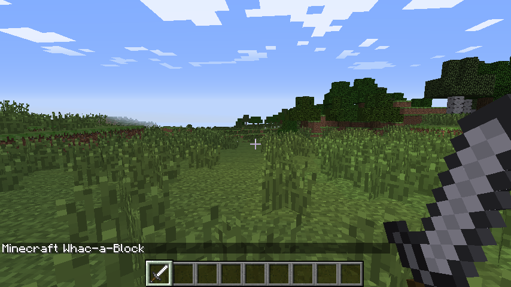
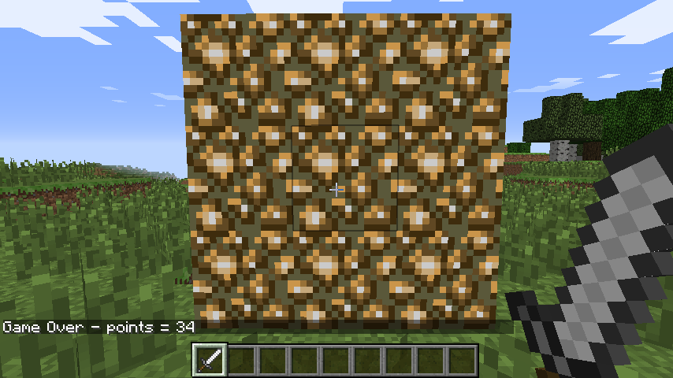

# Create a "Whac-a-Block" game in Minecraft

Minecraft is a popular sandbox open world-building game. A free version of Minecraft is available for the Raspberry Pi; it also comes with a programming interface. This means you can write commands and scripts in Python code to build things in the game automatically. It's a great way to learn Python!  

If you have already completed ["Getting Started With Programming The Minecraft World"](http://www.raspberrypi.org/learning/getting-started-with-minecraft-pi/) and want to do more, how about creating your own game in Minecraft, a "game in a game"?


## Whac-a-Block

The game you are going to create is called "Whac-a-Block", inspired by the original arcade game ["Whac-a-Mole"](http://en.wikipedia.org/wiki/Whac-A-Mole). The objective of the game is to whack (or hit with a sword) the blocks that light up as glowstone, and turn them back to stone. You will earn points for each block you turn back to stone and the game is over when all the blocks have been turned into glowstone.


This project is split into five parts:

1. Create the program - starting your Minecraft Python program and making sure everything is working.
2. Build the game board - creating the code which will make game board appear in front of the player.
3. Turn the blocks on - coding the functions to turn the blocks randomly into glowstone.
4. Whack blocks - turn the blocks back to stone when the player hits them.
5. Game over - the game is over, how many points did you score?

## Create the program

Open IDLE (**not** IDLE3) by using the icon on the desktop.

When the Python shell appears, create a new program using `File > New Window`. You may also want to save your program now using `File > Save`.

Import the Python libraries you are going to need for this program:

```python
import mcpi.minecraft as minecraft
import mcpi.block as block
import random
import time
```

- `mcpi.minecraft` - needed to interact with Minecraft: Pi Edition
- `mcpi.block` - needed to refer to blocks by name rather than ID
- `random` - used to create random numbers
- `time` - used to put delays into your program

Create a connection to Minecraft: Pi Edition and post a message to the chat window:

```python
mc = minecraft.Minecraft.create()
mc.postToChat("Minecraft Whac-a-Block")
```

You can run the program now. It won't do much, but if everything is set up correctly you should see "Minecraft Whac-a-Block" displayed in the Minecraft chat window.



If you haven't done so already, start up Minecraft and create/open a world. Run your program by clicking `Run > Run Module` in IDLE or pressing F5. Any errors will appear in red in the Python shell window.

## Build the game board

The next step is to create the game board; this consists of 3x3 stone blocks, which will randomly turn into glowstone and light up.

The game board will be created just in front of the player, so the first step is to get the player's position using `player.getTilePos()`:  

```python
pos = mc.player.getTilePos()
```

The player's position is then used with the `setBlocks()` function to create the game board out of stone:

```python
mc.setBlocks(pos.x - 1, pos.y, pos.z + 3,
             pos.x + 1, pos.y + 2, pos.z + 3,
             block.STONE.id)
```


To give the player a warning that the game is about to start, post a couple of messages to the chat window and put a delay into the program using `time.sleep(seconds)`:

```python
mc.postToChat("Get ready ...")
time.sleep(2)
mc.postToChat("Go")
```

Run the program again. You should see the game board appear directly in front of the player, and the messages "Get ready ..." and "Go".

## Turn the blocks on

Next, you are going to create the code which will turn the stone blocks to glowstone and light them up. The blocks will turn on randomly; you will use the `random.randint(start, end)` function to pick the random block on the game board.

Create a variable called `blocksLit`; this will hold the number of blocks which are currently lit (i.e. turned into glowstone). Next, create a variable called `points` which will hold how many points the player has scored. As it's the start of the game, set them both to 0:

```python
blocksLit = 0
points = 0
```

Your program will need to loop until the game is over, or in this case until all the blocks are lit.

Create a `while` loop which will continue until the `blocksLit` variable is 9 (i.e. all the blocks are turned to glowstone). Next, put a small delay of 0.2 seconds into the program; otherwise it will run so fast, you won't be able to whack any blocks!

```python
while blocksLit < 9:
    time.sleep(0.2)
```

From now on, the code will be indented under this `while` loop.

The next step is to randomly turn a block into glowstone. This is more difficult than it sounds; what happens if the block you randomly choose is already glowstone? Your code needs to be able to deal with this. 

The method you will use is a really simple one. The code creates a random position, checks to see if that block is stone, and if it isn't (i.e. it's glowstone), it tries again and creates a new random position. The code will continue to do this until it finds a block which is still unlit.

Create a variable called `lightCreated` then set it to `False`; next, create a `while` loop which will continue until `lightCreated` is set to `True`. You should also increase the number of `blocksLit` by 1, to show that another block will be lit:

```python
    blocksLit = blocksLit + 1
    lightCreated = False
    while not lightCreated:
```

Once a block is successfully turned to glowstone, `lightCreated` will be set to `True` and the loop will exit. 

Inside this loop use `random.randint(start, end)` to create a random `x` (between -1 and 1) and `y` (between 0 and 2) position on the game board:  

```python
        xPos = pos.x + random.randint(-1,1)
        yPos = pos.y + random.randint(0,2)
        zPos = pos.z + 3
```


Use `getBlock(x,y,z)` and an `if` statement to check if the block at the random position is STONE. If it is, set it to glowstone using `setBlock(x,y,z,blockId)` and make `lightCreated = True`; if this is not changed, the code will go back to the start of the loop and find another random position.

```python
        if mc.getBlock(xPos, yPos, zPos) == block.STONE.id:
            mc.setBlock(xPos, yPos, zPos, block.GLOWSTONE_BLOCK.id)
            lightCreated = True
```

**Note**: Rather than using the ID numbers of blocks (e.g. stone = 1, glowstone = 89), you can use the `block` module, which holds all the block IDs and their names (e.g. `block.STONE.id`).

Run the program by clicking `Run > Run Module` in IDLE or pressing F5; you should see the game board appear. The stone blocks should then, one by one, turn into glowstone and the program should end when all nine are lit.

## Whack blocks

The player will whack blocks by hitting them (right-clicking) while holding a sword. The Minecraft API has functions which allow you to find out what blocks were hit; these are known as block hit *events*. Using the function `events.pollBlockHits()` you can get a list of the events that have occurred since it was last called, such as blocks which were hit.

You will use events to find out the position of the block which was hit, before using `getBlock(x,y,z)` to see if the block hit was glowstone. If it was, you will then use `setBlock(x,y,z,blockId)` to turn it back to stone, before reducing the number of blocks lit and increasing the player's score.

Indented under the `while blocksLit < 9` loop, create the following code to loop through the block hit events list:

```python
    for hitBlock in mc.events.pollBlockHits():
```

**Note**: The `hitBlock` variable holds the *event* which has happened. It contains lots of information, including which block was hit, what face was hit and who hit it. You can see this information in the Python shell by using `print hitBlock`.

Use `getBlock(x,y,z)`, the `hitBlock` event data and an `if` statement to see if the block hit was glowstone. If it was, use `setBlock(x,y,z,blockId)` to set it back to stone before reducing the `blocksLit` variable and adding 1 to the player's `points`:

```python
        if mc.getBlock(hitBlock.pos.x, hitBlock.pos.y, hitBlock.pos.z) == block.GLOWSTONE_BLOCK.id:
            mc.setBlock(hitBlock.pos.x, hitBlock.pos.y, hitBlock.pos.z, block.STONE.id)
            blocksLit = blocksLit - 1
            points = points + 1 
```

Run the program. The game board should appear and this time when the blocks are lit, if you hit them by right-clicking with a sword, they should turn off.

## Game over

The last step in the game is to let the player know it's "Game Over" and to tell them how many points they scored. The very last line of the program should be:

```python
mc.postToChat("Game Over - points = " + str(points))
```



## What's next?

It might be the end of this worksheet, but it doesn't have to be the end of this game.  

At the moment the gameplay is pretty basic, and there's a lot you can do now you have the basic program set up to make it your own. Here are some ideas to get you started:

1. The difficulty of the game is set by the how long the program waits before lighting another block, currently `time.sleep(0.2)`. By increasing this time you make the game easier, and decreasing it will make the game harder. Experiment and see what works best for you.

1. What if the player gets things wrong and hits a stone block instead of a glowstone block? Can you change the program so that if the player hits a stone block, it lights the block? This forces the player to think more about what block they are hitting and increases the skill required.

1. It is common for video games to start easy and get harder. Can you make the game start easier and the more points you score, the harder it gets?

### API reference

For more extensive documentation of functions, and a full list of block IDs, see an API reference at [stuffaboutcode.com](http://www.stuffaboutcode.com/p/minecraft-api-reference.html).
